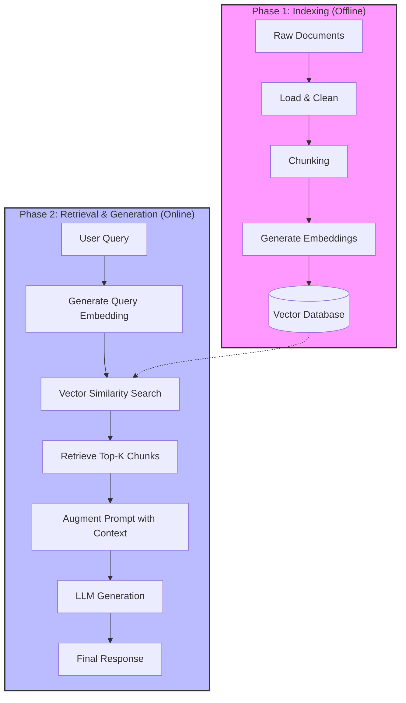

# RAG Chunking Strategies

This document outlines the retrieval-augmented generation (RAG) chunking strategies used in this project. Choosing the right chunking method is critical for optimal retrieval performance.

## 📊 Chunking Methodologies

| Method | Best For... | Description |
| :--- | :--- | :--- |
| **Structure-based** | Formatted Documents | Best results when you control document formatting (like internal company reports or Markdown files). |
| **Sentence-based** | Text Documents | Good middle ground for most text documents; preserves semantic boundaries. |
| **Size-based** | Generic / Code | Most reliable fallback that works with any content type, including code. |

---

## 🔄 RAG Pipeline Flow

The following diagram illustrates the two primary phases of our RAG system: **Indexing** (Offline) and **Retrieval/Generation** (Online).



---


## 💻 Implementation Examples

Refer to [001_chunking.ipynb](file:///Users/d3vil/Documents/projects/ac/RAG/001_chunking.ipynb) for the full implementation.

### 1. Structure-based (Section)
Splits documents based on headers (e.g., `## `).

```python
import re

def chunk_by_section(document_text):
    pattern = r"\n## "
    return re.split(pattern, document_text)
```

### 2. Sentence-based
Splits text into chunks containing a fixed number of sentences with overlap.

```python
import re

def chunk_by_sentence(text, max_sentences_per_chunk=5, overlap_sentences=1):
    sentences = re.split(r"(?<=[.!?])\s+", text)
    chunks = []
    start_idx = 0
    while start_idx < len(sentences):
        end_idx = min(start_idx + max_sentences_per_chunk, len(sentences))
        current_chunk = sentences[start_idx:end_idx]
        chunks.append(" ".join(current_chunk))
        start_idx += max_sentences_per_chunk - overlap_sentences
        if start_idx < 0:
            start_idx = 0
    return chunks
```

### 3. Size-based (Character count)
A reliable fallback that chunks by a set number of characters.

```python
def chunk_by_char(text, chunk_size=150, chunk_overlap=20):
    chunks = []
    start_idx = 0
    while start_idx < len(text):
        end_idx = min(start_idx + chunk_size, len(text))
        chunk_text = text[start_idx:end_idx]
        chunks.append(chunk_text)
        start_idx = (
            end_idx - chunk_overlap if end_idx < len(text) else len(text)
        )
    return chunks
```
---

## 🧠 Text Embeddings & Semantic Search

Semantic search enables retrieval based on meaning rather than just keyword matching. We use **Voyage AI** for high-quality text embeddings.

### 🚀 Setup & Model Selection
- **Library**: `voyageai`
- **Recommended Model**: `voyage-3-large`
- **Dimensionality**: **1024** (Standard for `voyage-3-large`)
- **Similarity Metric**: **Cosine Similarity** (Recommended for measuring vector closeness)

### 📐 What are Vector Embeddings?
Vector embeddings are high-dimensional numerical representations of text. By mapping words and sentences to a 1024-dimensional space, the model can "understand" that "Software Engineering" and "Coding" are semantically close, even if they share no common keywords.

### 📏 Vector Normalization (L2)
To ensure accurate similarity measurements, vectors are typically **normalized** to a unit length (magnitude of 1). 
- **Why?**: Normalization ensures that the "length" or "volume" of text doesn't skew the results. 
- **Benefit**: When vectors are L2-normalized, **Cosine Similarity** is mathematically equivalent to the **Dot Product**, making retrieval calculations faster and more consistent.

### 📐 Cosine Similarity
Cosine similarity measures the cosine of the angle between two vectors. It is the gold standard for measuring semantic closeness in high-dimensional spaces.

**Mathematical Formula:**
$$\text{similarity}(\mathbf{A}, \mathbf{B}) = \frac{\mathbf{A} \cdot \mathbf{B}}{\|\mathbf{A}\| \|\mathbf{B}\|} = \frac{\sum_{i=1}^{n} A_i B_i}{\sqrt{\sum_{i=1}^{n} A_i^2} \sqrt{\sum_{i=1}^{n} B_i^2}}$$

**Simplified (Normalized):**
If vectors $\mathbf{A}$ and $\mathbf{B}$ are already L2-normalized, the denominator becomes 1, and the similarity is simply the **Dot Product**:
$$\text{similarity} = \mathbf{A} \cdot \mathbf{B}$$

**🔍 Key Interpretation Points:**
- **Range**: Results range from **-1 to 1**.
- **1 (High Similarity)**: The vectors point in the same direction (semantically very similar).
- **-1 (Opposite)**: The vectors point in opposite directions (semantically different).
- **0 (Perpendicular)**: There is no relationship between the vectors.


### 📖 Embedding Generation
When generating embeddings, specify the `input_type` to optimize the vector space:
- `document`: Use for the content being indexed.
- `query`: Use for the user's search query.

```python
import voyageai
from dotenv import load_dotenv

load_dotenv()
client = voyageai.Client()

def generate_embedding(text, model="voyage-3-large", input_type="document"):
    """
    Generates a vector embedding for a given text.
    input_type should be 'document' for indexing and 'query' for searching.
    """
    result = client.embed([text], model=model, input_type=input_type)
    return result.embeddings[0]
```

### 🔍 Semantic Search Workflow
1. **Chunking**: Break documents into smaller pieces (see [Chunking Methodologies](#-chunking-methodologies)).
2. **Indexing**: Generate `document` embeddings for each chunk and store them in a vector database.
3. **Retrieval**: Generate a `query` embedding for the user's prompt and perform a similarity search (e.g., Cosine Similarity) against the indexed chunks.

---

## 🛠️ Detailed RAG Implementation

Now that we understand the RAG flow conceptually, let's implement it step-by-step using a practical example from [003_vectordb.ipynb](file:///Users/d3vil/Documents/projects/ac/RAG/003_vectordb.ipynb).

### The Five-Step RAG Flow
Our implementation follows a standard pipeline to transform raw documents into a searchable knowledge base.

#### Step 1: Chunking the Text
We load our source document (e.g., `report.md`) and split it into logical sections based on headers.
```python
with open("./report.md", "r") as f:
    text = f.read()

chunks = chunk_by_section(text)
```

#### Step 2: Generate Embeddings
We generate vector representations for all chunks. Our `generate_embedding` function is optimized for batch processing.
```python
embeddings = generate_embedding(chunks)
```

#### Step 3: Store in Vector Database
We populate a `VectorIndex` with the generated embeddings and their associated text content.
```python
store = VectorIndex()

for embedding, chunk in zip(embeddings, chunks):
    store.add_vector(embedding, {"content": chunk})
```
> [!IMPORTANT]
> **Why Store the Original Text?**
> When searching, the database returns the closest vectors. However, we need the *human-readable text* associated with those vectors to augment the LLM's prompt. Without storing the original content, we would only have meaningless numerical arrays.

#### Step 4: Process User Queries
When a user asks a question, we convert their natural language query into the same 1024-dimensional vector space.
```python
user_embedding = generate_embedding("What did the software engineering dept do last year?")
```

#### Step 5: Find Relevant Content
Finally, we perform a similarity search to find the top $K$ most relevant chunks.
```python
results = store.search(user_embedding, k=2)

for doc, distance in results:
    print(f"Distance: {distance:.4f}")
    print(f"Content: {doc['content'][:200]}...\n")
```

### 🧐 Understanding the Results
The search returns chunks sorted by their **distance** (inverse of similarity) to the query. 
- **Lower distance** = Higher semantic similarity.
---

## 🔎 BM25 Lexical Search

When building RAG pipelines, semantic search alone may miss exact term matches (e.g., technical IDs or unique codes). We use **BM25 (Best Match 25)** to complement semantic search with lexical accuracy.

### ❓ The Problem with Semantic Search Alone
Semantic search excels at understanding context but may return conceptually related chunks that lack the specific term you need. For example, searching for a specific incident ID like `INC-2023-Q4-011` might return general "Cybersecurity" sections without the exact match.

### 🤝 Hybrid Search Strategy
A robust RAG system combines both approaches:
1.  **Semantic Search**: Finds conceptually related content using embeddings.
2.  **Lexical Search (BM25)**: Finds exact term matches using classic text search.
3.  **Reranking/Merging**: Combines results for maximum retrieval accuracy.

### ⚙️ How BM25 Works
BM25 (Best Match 25) is a popular algorithm for lexical search in RAG systems. Here's how it processes a search query:

- **Step 1: Tokenize the query**: Break the user's question into individual terms. For example, `"a INC-2023-Q4-011"` becomes `["a", "INC-2023-Q4-011"]`.
- **Step 2: Count term frequency**: See how often each term appears across all your documents. Common words like "a" might appear many times, while specific terms like `INC-2023-Q4-011` might appear only once.
- **Step 3: Weight terms by importance**: Terms that appear less frequently get higher importance scores. The word "a" gets low importance because it's common, while `INC-2023-Q4-011` gets high importance because it's rare.
- **Step 4: Find best matches**: Return documents that contain more instances of the higher-weighted terms.


### 💻 Implementing BM25 Search
Refer to [004_bm25.ipynb](file:///Users/d3vil/Documents/projects/ac/RAG/004_bm25.ipynb) for the full implementation of the `BM25Index`.

```python
# 1. Chunk and Load
chunks = chunk_by_section(text)

# 2. Create BM25 store and add documents
store = BM25Index()
for chunk in chunks:
    store.add_document({"content": chunk})

# 3. Search for specific IDs
results = store.search("What happened with INC-2023-Q4-011?", k=3)

for doc, distance in results:
    # Note: BM25Index here uses distance (1 - similarity) for consistency
    print(f"Distance: {distance:.4f}")
    print(f"Content: {doc['content'][:200]}...\n")
```

### 📈 Why BM25 Works Better for Technical Queries
BM25's focus on **term frequency** and **rarity** makes it ideal for finding:
- Technical terms and acronyms.
- Product IDs or Incident IDs.
- Specific phrases or names.

---

## 🏗️ Multi-Index Hybrid RAG

High-performance RAG systems often use a **Multi-Index** approach, combining multiple retrieval strategies (e.g., Semantic and Lexical) to ensure no relevant information is missed. To merge these disparate result sets fairly, we use the **Reciprocal Rank Fusion (RRF)** algorithm.

### 🧬 Reciprocal Rank Fusion (RRF)
RRF is a simple yet powerful algorithm for combining several result lists into a single, unified ranking. It doesn't rely on the raw scores from each index (which can be on different scales) but instead uses the **rank** of each document.

**The RRF Formula:**
$$\text{RRFScore}(d) = \sum_{r \in R} \frac{1}{k + \text{rank}(d, r)}$$

- $R$: The set of result lists (indices).
- $\text{rank}(d, r)$: The position of document $d$ in result list $r$.
- $k$: A constant (smoothing factor) that helps mitigate the impact of very low-ranked documents (default is often **60**).

### 🔄 Hybrid Retrieval Steps
Our implementation follows these steps:
1.  **Parallel Search**: Query both the `VectorIndex` (Semantic) and `BM25Index` (Lexical).
2.  **Rank Assignment**: Assign a rank (1, 2, 3...) to every document returned by each index.
3.  **Score Calculation**: Apply the RRF formula to calculate a cumulative score for each unique document.
4.  **Final Sorting**: Sort the combined documents by their RRF score in descending order.

### 💻 Implementation Example
Refer to [005_hybrid.ipynb](file:///Users/d3vil/Documents/projects/ac/RAG/005_hybrid(bm25+se,manticsearch).ipynb) for the full `Retriever` implementation.

```python
# 1. Initialize Indexes
vector_index = VectorIndex(embedding_fn=generate_embedding)
bm25_index = BM25Index()

# 2. Create Hybrid Retriever
retriever = Retriever(bm25_index, vector_index)

# 3. Add Documents (internally populates both indexes)
retriever.add_documents([{"content": chunk} for chunk in chunks])

# 4. Hybrid Search
# k_rrf is the smoothing factor (default 60)
results = retriever.search("What happened with INC-2023-Q4-011?", k=3, k_rrf=60)

for doc, rrf_score in results:
    print(f"RRF Score: {rrf_score:.4f}")
    print(f"Content: {doc['content'][:200]}...\n")
```

### 🎯 Why Use Hybrid Search?
- **Robustness**: Handles both conceptual questions ("How do we improve code quality?") and specific lookups ("Show me INC-2023-Q4-011").
- **Precision**: Lexical search acts as a filter for exact terms, while semantic search provides broader context.
- **Scalability**: Easily extendable by adding more indices (e.g., knowledge graphs or metadata filters).


